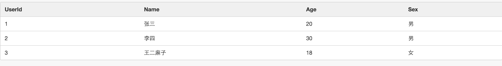

# 说明
本 repository 是最初学习Java开发时候做的一个例子，后续慢慢维护，希望成为最简单、最全的入门例子，麻雀虽小，五脏俱全
使用到的技术如下：

- maven 项目管理
- spring mvc 框架
- mybatis 持久层框架，例子中包括MySQL、SqlServer的连接案例，包含取多条（list)转换、where条件的in案例等[动态sql例子](https://mybatis.github.io/mybatis-3/zh/dynamic-sql.html)，详细可以阅读[mybaits动态sql语句学习](http://limingnihao.iteye.com/blog/782190)
- freemarker 模板框架

其它：
- [semantic ui前端框架](http://www.semantic-ui.com/)，负责整体的css、布局、交互等；

# 使用方法
1. fork 代码
2. 使用工具 idea 或者 eclipe 导入 现有maven项目，maven会自动下载所以来的jar包；
3. 将 `doc` 文件夹中的sql脚本部署到MySQL中，取的MySQL连接串，修改 `jdbc.properties` 中MySQL节点的url、user、password
4. 调试代码，即可在页面中看到效果
